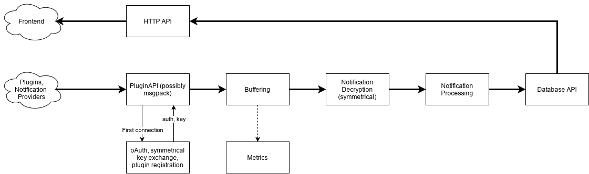

Initial structure:

TODO:

- [ ] Convert sketches to designs and documentation
- [ ] Setup a project management scheme
  - [ ] Write issues
  - [ ] Setup Create Issue Branch
  - [ ] Setup a kanban board
  - [ ] Prioritize tasks
- [ ] Setup a build system
  - [ ] Setup github actions for linting and building
  - [ ] Setup test suites
