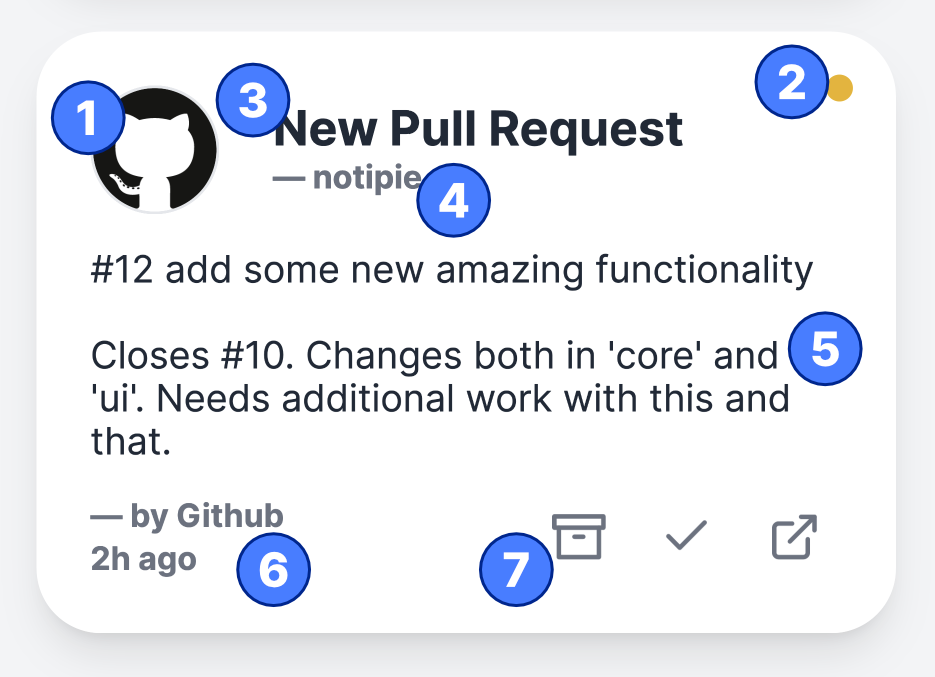
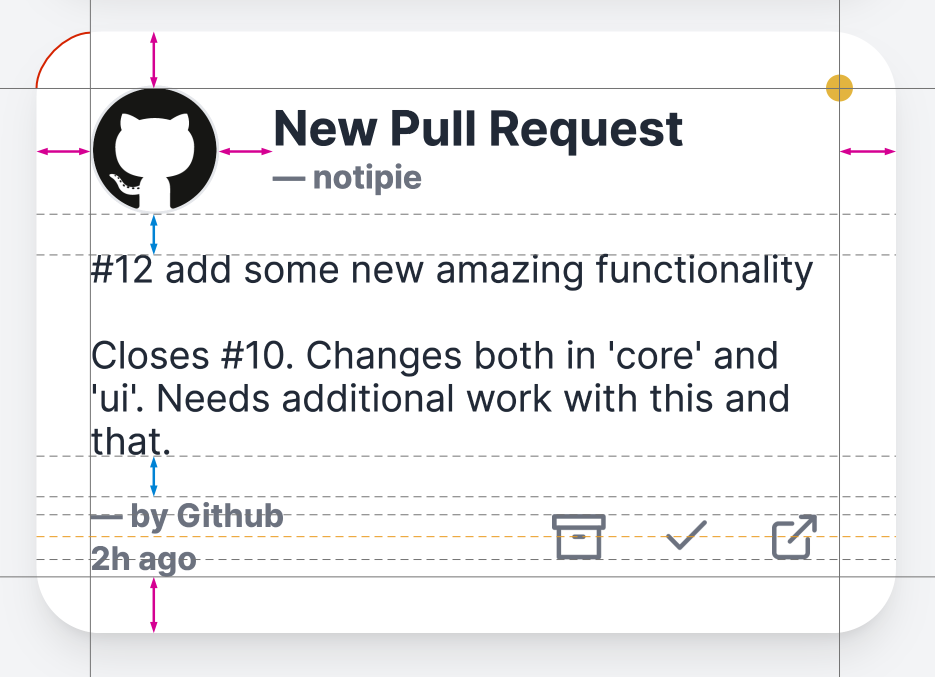

# UI Design

When designing the UI of Notipie, I tried to maximize usability, and minimize
complexity of the interface.

## Inspirations

My main inspirations for the interface were
[Apple Human Interface Guidelines](https://developer.apple.com/design/human-interface-guidelines/)
and [Google's Material Design](https://material.io),
but by far the most inspiration was taken from
[Github Primer](https://primer.style).

I tried to break down what is useful, what is unnecessary in my project, and
extract only the essentials for my design.

## Final design

### The card

The card is a building block for the entire user interface. It provides the
most interaction in the whole application, therefore it had to be designed with
clearly laid out information and intuitive controls.

The card itself consists of several elements:
1. logo, it can be an image or automatically generated SVG from the first two
   letters of the app's name,
2. indicator, whether the notification has been seen or not,
3. title of the notification,
4. subtitle,
5. body, that collapses after it reaches a certain length, so that an ellipsis
   appears (`[...]`),
6. information about what app sent the notification and when it happened,
7. controls to archive, mark as read, or go to external site connected with the
   notification, like a certain build on Jenkins, or the notification page on Github.

 

The card was also designed with aesthetics in mind. All elements were carefully
positioned and aligned, so they are not only pleasant to look at, but also have
some features important for visual communication:
- the rounded corners take the focus away from the card frame, and provide a
  natural, neutral enclosure for the notification,
- the inner padding is of equal size in each direction to provide optical
  stability,
- the distance between the logo and title – subtitle combo is the same size as
  the padding, making the logo appear centered,
- the title – subtitle combo itself is centered vertically relative to the logo,
- the distances between the logo, notification body, and app name – timestamp
  combo are shorter in order to make the inner section more connected,
- the controls are centered relative to the app name – timestamp combo,
- the _unread_ indicator is unobtrusive enough not to steal all the focus from
  the card's content,
- finally, the _unread_ indicator is positioned slightly outside the inner
  section, so that it belongs to the card itself, not its content, therefore
  it is easier to spot at a glance.
